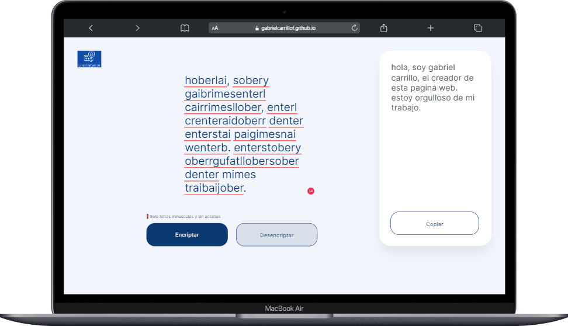

# Encriptador de Texto

[](https://github.com/GabrielCarrilloF/Encriptado-de-texto)

## Índice

1. [Descripción del Proyecto](#descripción-del-proyecto)
2. [Estado del Proyecto](#estado-del-proyecto)
3. [Demostración de Funciones y Aplicaciones](#demostración-de-funciones-y-aplicaciones)
4. [Acceso al Proyecto](#acceso-al-proyecto)
5. [Tecnologías Utilizadas](#tecnologías-utilizadas)
6. [Personas Contribuyentes](#personas-contribuyentes)
7. [Personas Desarrolladoras del Proyecto](#personas-desarrolladoras-del-proyecto)

## Descripción del Proyecto

Encriptador es un sistema que te permite encriptar o desencriptar texto de manera sencilla y eficiente. La encriptación convierte tu texto en un formato seguro para proteger información sensible, mientras que la desencriptación recupera el texto original.

### ¿Cómo Funciona la Encriptación y Desencriptación?

El sistema utiliza un método de reemplazo simple para encriptar y desencriptar el texto. Aquí hay un resumen del proceso:

- **Encriptación**: Cada vocal en el texto original se reemplaza con una secuencia específica:
  - 'a' se reemplaza con 'ai'
  - 'e' se reemplaza con 'enter'
  - 'i' se reemplaza con 'imes'
  - 'o' se reemplaza con 'ober'
  - 'u' se reemplaza con 'ufat'

- **Desencriptación**: La secuencia específica se reemplaza nuevamente por la vocal original:
  - 'ai' se reemplaza con 'a'
  - 'enter' se reemplaza con 'e'
  - 'imes' se reemplaza con 'i'
  - 'ober' se reemplaza con 'o'
  - 'ufat' se reemplaza con 'u'

## Estado del Proyecto

El proyecto está en desarrollo. Se están agregando nuevas funcionalidades y mejorando la interfaz de usuario.

## Demostración de Funciones y Aplicaciones

### Pantalla Principal


### Texto Encriptado


### Texto Desencriptado



## Acceso al Proyecto

Puedes acceder al proyecto clonado el repositorio:

```bash
git clone https://github.com/GabrielCarrilloF/Encriptado-de-texto.git
cd Encriptado-de-texto
```
También puedes usar la aplicación directamente desde [GitHub Pages](https://gabrielcarrillof.github.io/Encriptado-de-texto/).

## Tecnologías Utilizadas

- **HTML5**: Para la estructura de la aplicación.
- **CSS3**: Para el diseño y la apariencia.
- **JavaScript**: Para la lógica de encriptación y desencriptación.

## Personas Contribuyentes

- [Nombre del Contribuyente 1](https://github.com/usuario1)
- [Nombre del Contribuyente 2](https://github.com/usuario2)

## Personas Desarrolladoras del Proyecto

- [Gabriel Carrillo](https://github.com/GabrielCarrilloF)

